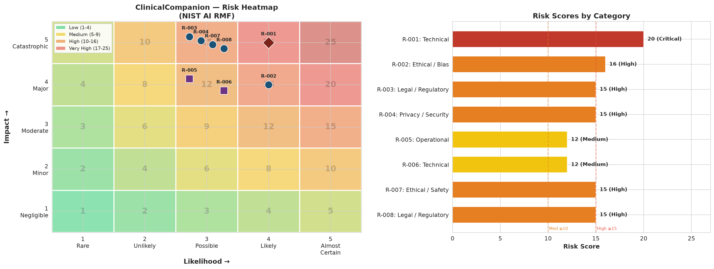
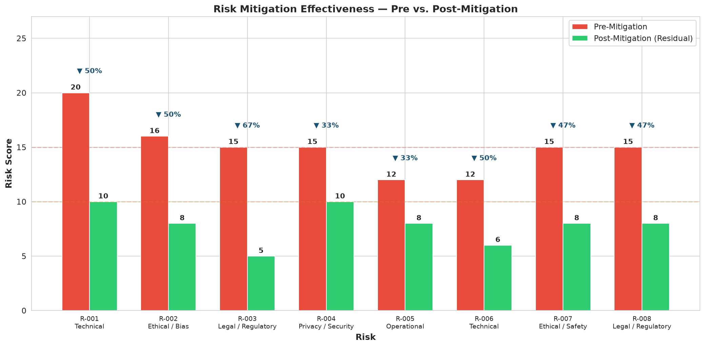
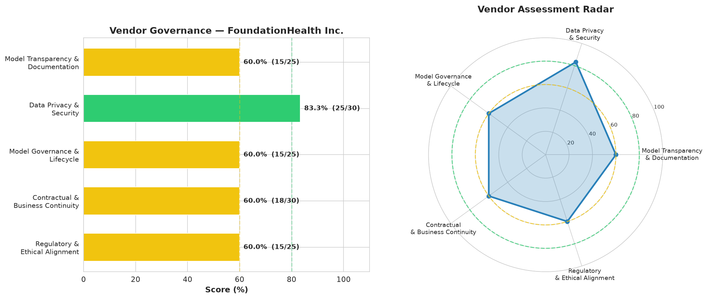
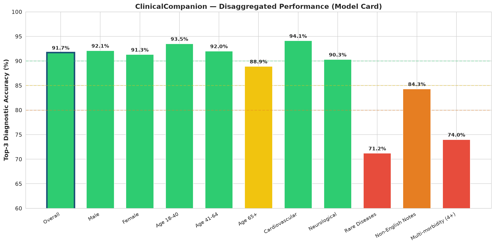
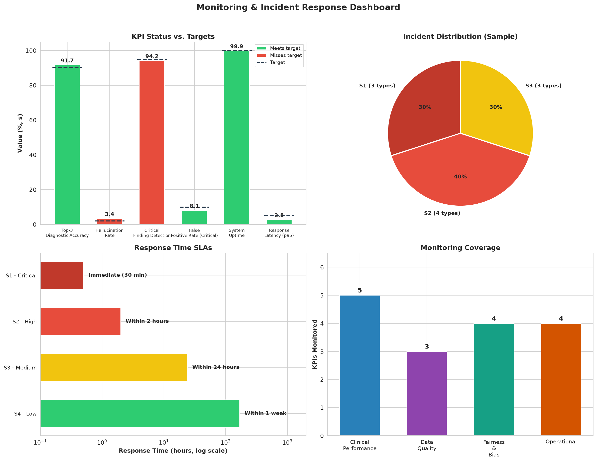
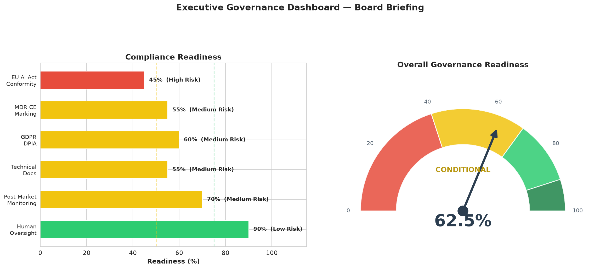

# Cleared for Launch: AI Governance Assessment — ClinicalCompanion

A completed AI governance assessment for **ClinicalCompanion v1.0**, a generative-AI clinical decision support system (CDSS) built on the FoundationHealth Medical LLM v3.2 (7B, API), prepared for EU market launch by MedAssist AI.

Deliverables live in [`project/starter/`](project/starter/):

| Deliverable | File |
|---|---|
| Code analysis (8 steps, runs end-to-end) | [`governance_assessment.ipynb`](project/starter/governance_assessment.ipynb) |
| Written governance workbook (6 sheets, no placeholders) | [`governance_workbook.xlsx`](project/starter/governance_workbook.xlsx) |
| 6 visualizations | [`results/`](project/starter/results/) |

## Assessment Results

### EU AI Act Classification
**HIGH-RISK AI system under Article 6(1)** — ClinicalCompanion is a medical device (MDR 2017/745, Class IIa under Rule 11) covered by Annex I harmonisation legislation. No Article 5 prohibited practices apply; it is not Annex III-listed. Compliance gap analysis across Articles 8–15: of 16 requirements, **2 compliant, 14 open gaps — 1 Critical, 5 High, 8 Medium, 2 Low**. The Critical gap is Article 15 Accuracy: hallucination rate **3.4% vs the <2% target**.

### Risk Assessment (NIST AI RMF)
8 risks scored on the 5×5 likelihood × impact matrix: **1 Critical (R-001 clinical hallucinations, score 20), 5 High (15–16), 2 Medium (12)**; average score 15.0. By RMF function, **Measure carries the highest total risk (32)**, followed by Map (31), Govern (30), Manage (27). Planned mitigations reduce total risk **120 → 63 (−47.5%)** — best R-003 (−66.7%), weakest R-004/R-005 (−33.3%) — but every mitigation is still Planned or In Progress.




### Vendor Evaluation — FoundationHealth Inc.
Overall score **88/135 (65.2%) → Medium Risk**. Data Privacy & Security is the lone strength (83.3%, Low Risk — clean SOC 2 Type II, HIPAA BAA, ISO 27001); the other four categories all sit at exactly 60%. Weakest criteria: ISO/IEC 42001 certification (1/5), training-data transparency (2/5), vendor lock-in (2/5), disaggregated bias testing (2/5). **Recommendation: CONDITIONAL APPROVAL** with contract amendments (escrow/portability, joint TIA, self-service rollback, clinical-outcome liability coverage).



### Model Card — Disaggregated Performance
Overall Top-3 diagnostic accuracy **91.7% (meets the 90% target)**, but four subgroups fall below it: **Rare Diseases 71.2%** (18.8 pp below target), **Multi-morbidity 4+ 74.0%**, **Non-English Notes 84.3%** (critical for the DE/FR/NL launch markets), and **Age 65+ 88.9%**. Aggregate fairness ratios pass (equalized odds 0.96, demographic parity 0.91, predictive parity 0.94) but mask these axes — an Article 10 dataset-representativeness gap requiring data augmentation before general availability.



### Monitoring & Incident Response
16 KPIs across 4 dimensions (Clinical Performance 5, Fairness & Bias 4, Operational 4, Data Quality 3), a 10-type AI incident taxonomy, and S1–S4 severity SLAs (30 min → 1 week). KPI-002 (hallucination rate) is **already failing at baseline**. Four monitoring gaps identified: no KPIs for physician override rate (automation bias), adversarial/prompt-injection attempts, vendor model-version regressions, or cross-border transfer compliance.



### Executive Readiness
**Overall governance readiness: 62.5% → CONDITIONAL launch recommendation.** By area: EU AI Act conformity 45%, MDR CE marking 55%, technical documentation 55%, GDPR DPIA 60%, post-market monitoring 70%, human oversight 90% (the one Article 14-compliant strength). Estimated **~3 months to a conditional Phase-1 pilot** (3 German hospitals), gated on: hallucination rate <2%, Notified Body conformity assessment passed, vendor contract amendments signed, and DPIA/TIA updated. EU-wide availability no earlier than Month 9.



## Reproducing

```bash
python3 -m venv .venv && .venv/bin/pip install -r requirements.txt
cd project/starter
../../.venv/bin/jupyter nbconvert --to notebook --execute --inplace governance_assessment.ipynb
```

All 6 PNGs are regenerated into `project/starter/results/`.
